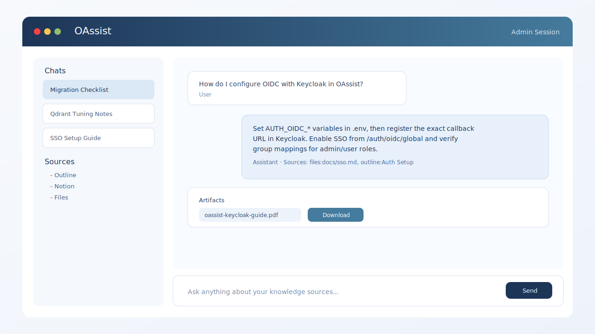
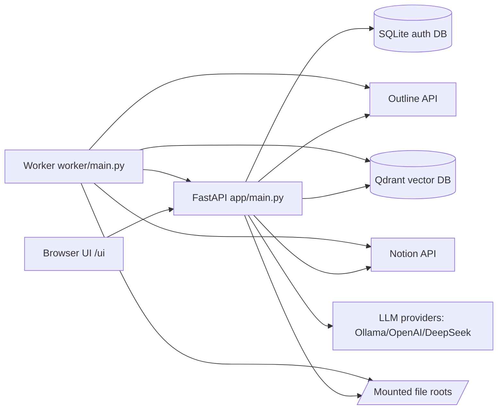

# OAssist

[](https://www.python.org/)
[](https://fastapi.tiangolo.com/)
[](https://qdrant.tech/)
[](#features)

Production-focused AI assistant with RAG over multiple knowledge sources (`outline`, `notion`, `files`), strict ACL isolation, chat uploads, generated downloadable artifacts, and optional Keycloak-compatible OIDC login.

This repository ships a complete web UI (`/ui`), API, and background indexing worker.

## Table of Contents

- [Why OAssist](#why-oassist)
- [Features](#features)
- [Chat UI Preview](#chat-ui-preview)
- [Architecture](#architecture)
- [Role and Access Model](#role-and-access-model)
- [Supported File Formats](#supported-file-formats)
- [Quick Start (Docker)](#quick-start-docker)
- [Configuration](#configuration)
- [Authentication](#authentication)
- [Files Source Workflows](#files-source-workflows)
- [API Overview](#api-overview)
- [cURL Examples](#curl-examples)
- [Operations and Troubleshooting](#operations-and-troubleshooting)
- [Project Structure](#project-structure)
- [Known Limitations](#known-limitations)
- [Additional Documentation](#additional-documentation)

## Why OAssist

OAssist is built for teams that need:

- One assistant over internal docs and file trees.
- Predictable access control (global defaults + per-user overrides).
- Practical admin UX (source toggles, ACL management, sync controls, provider health).
- Upload-and-analyze chat workflow and generated output files (`docx/xlsx/pdf/md/txt/csv/json`).
- A deployment model that runs locally in Docker and scales behind reverse proxies.

## Features

### Core AI and Retrieval

- Multi-provider LLM routing with fallback (`ollama -> openai -> deepseek`).
- Retrieval-Augmented Generation over Qdrant vector index.
- Source-aware results with citations in assistant responses.
- Batched embeddings for better indexing throughput.

### Source Management

- Three sources with unified UX and ACL behavior:
  - `outline`
  - `notion`
  - `files`
- Global source toggles persisted in DB (`/sources/global`).
- User source mode support (`outline`, `notion`, `both`) plus `files` source control.

### Files Source (v1.1 core)

- Configurable root folders (`1..N`) for indexed file trees.
- Normalized IDs: `files:<root_id>:<relative_path>`.
- Read-only/read-write mode for write operations.
- Tree/document/download APIs with ACL filtering.
- Write workflow with preview/apply/audit.
- Incremental RAG updates on create/update/move/delete.

### Chat Uploads and Artifacts

- Upload modes:
  - `ephemeral` (chat/session-scoped)
  - `indexable` (copied under files roots and indexed)
- Upload policy controls (size, TTL, extension whitelist, indexable toggle).
- Artifact generation in `docx`, `xlsx`, `pdf`, `md`, `txt`, `csv`, `json`.
- Signed/one-time token download links and retention cleanup.

### Authentication and Security Boundaries

- Local auth (username/password) with session cookies.
- OIDC (Keycloak-compatible) login flow with runtime enable/disable.
- Role model:
  - `admin` (with super-admin privileges only for local `admin` account)
  - `user`
- Strict owner-or-admin access checks for uploads/artifacts.
- Path traversal protections for file operations.

### UI and State

- Single-page admin + chat interface at `/ui`.
- Per-user chat state sync (`/chat/state`) with timestamp conflict checks.
- Source trees for Outline/Notion/Files with ACL-aware visibility.
- User manager and ACL editor for super-admin workflows.

## Chat UI Preview



## Architecture



Runtime services in `docker-compose.yml`:

- `oassist-api` (FastAPI, exposed on `8181` -> container `8081`)
- `oassist-worker` (periodic indexing)
- `qdrant` (vector storage, `6333`)
- `ollama` (optional profile, `11434`)

## Role and Access Model

| Role | Capabilities |
|------|--------------|
| Super-admin (local username `admin`) | Manage global source toggles, global ACL defaults, per-user ACL overrides, OIDC runtime switch, files roots/settings |
| Admin (`role=admin`, non-`admin` username) | Manage users in allowed scope; no super-admin/global controls |
| User (`role=user`) | Access only effective ACL documents; use chat/uploads/artifacts inside ownership rules |

ACL rules:

- Global defaults are baseline.
- User override replaces baseline when present.
- Parent/folder selections expand to descendants.

## Supported File Formats

### Indexing and Retrieval (Files source)

- Text/code: `txt, md, rst, csv, tsv, json, yaml, yml, xml, ini, conf, log, html, css, scss, less, js, mjs, cjs, ts, jsx, tsx, py, java, kt, go, rs, c, h, cpp, hpp, cs, php, rb, swift, sql, sh, bash, zsh, ps1`.
- Office docs: `pdf, docx, xlsx, pptx`.

### Write Operations (read-write mode)

- Text/code formats only (includes `dockerfile`, `makefile` naming support).
- Binary office editing is intentionally not part of v1.1 write flow.

### Generated Artifacts

- `docx`, `xlsx`, `pdf`, `md`, `txt`, `csv`, `json`.

## Quick Start (Docker)

1. Create your environment file:

```bash
cp .env.example .env
```

2. Set required values in `.env`:

- `AUTH_BOOTSTRAP_ADMIN_USERNAME`
- `AUTH_BOOTSTRAP_ADMIN_PASSWORD`
- `OUTLINE_BASE_URL`
- `OUTLINE_API_TOKEN` (can be empty string if Outline sync is not used, but key must exist)

3. Start services:

```bash
docker compose --profile ollama up -d --build
```

4. Open UI:

- `http://localhost:8181/ui`

5. Smoke check:

```bash
curl http://localhost:8181/health
curl http://localhost:8181/health/providers
```

## Configuration

Copy `.env.example` and adjust values. Main groups are listed below.

### Auth and Sessions

| Variable | Purpose | Default |
|----------|---------|---------|
| `AUTH_DB_PATH` | SQLite auth/state DB path | `/data/oassist_auth.db` |
| `AUTH_SESSION_TTL_HOURS` | Session lifetime in hours | `168` |
| `AUTH_BOOTSTRAP_ADMIN_USERNAME` | Initial admin username | `admin` |
| `AUTH_BOOTSTRAP_ADMIN_PASSWORD` | Initial admin password | `admin12345` |

### OIDC (Keycloak-compatible)

| Variable | Purpose |
|----------|---------|
| `AUTH_OIDC_ENABLED` | Enables OIDC configuration usage |
| `AUTH_OIDC_CLIENT_ID` | OIDC client ID |
| `AUTH_OIDC_CLIENT_SECRET` | OIDC client secret |
| `AUTH_OIDC_AUTH_URI` | Authorization endpoint |
| `AUTH_OIDC_TOKEN_URI` | Token endpoint |
| `AUTH_OIDC_USERINFO_URI` | Userinfo endpoint |
| `AUTH_OIDC_REDIRECT_URI` | Callback URL registered in IdP |
| `AUTH_OIDC_SCOPES` | Requested scopes |
| `AUTH_OIDC_GROUPS_CLAIM` | Claim path for groups |
| `AUTH_OIDC_ADMIN_GROUP` | Group mapped to admin role |
| `AUTH_OIDC_USER_GROUP` | Group mapped to user role |
| `AUTH_OIDC_DISPLAY_NAME` | UI label for SSO button |

### Source and AI

| Variable | Purpose | Default |
|----------|---------|---------|
| `QDRANT_URL` | Qdrant endpoint | `http://qdrant:6333` |
| `QDRANT_COLLECTION` | Vector collection name | `outline_docs` |
| `LLM_PROVIDER` | `auto`, `ollama`, `openai`, `deepseek` | `auto` |
| `LLM_FALLBACK_ORDER` | Provider fallback sequence | `ollama,openai,deepseek` |
| `EMBEDDING_PROVIDER` | `ollama` or `openai` | `ollama` |
| `OLLAMA_BASE_URL` | Ollama endpoint | `http://ollama:11434` |

### Indexing and Search

| Variable | Purpose | Default |
|----------|---------|---------|
| `SYNC_INTERVAL_SECONDS` | Worker sync interval | `300` |
| `CHUNK_SIZE` | Chunk size for indexing | `1200` |
| `CHUNK_OVERLAP` | Overlap between chunks | `200` |
| `SEARCH_TOP_K` | Retrieval top-k | `6` |
| `SEARCH_MIN_SCORE` | Minimum score threshold | `0.68` |

## Authentication

### Local Login

- `POST /auth/login` creates session cookie `oassist_session`.
- `GET /auth/me` returns current user and auth method.
- `POST /auth/logout` revokes the session.

### OIDC Login

Flow endpoints:

- `GET /auth/oidc/config`
- `GET /auth/oidc/start`
- `GET /auth/oidc.callback` and `GET /auth/oidc/callback` (aliases)
- `POST /auth/oidc/exchange` (ticket-to-cookie fallback after callback)

Runtime toggle (super-admin only):

- `GET /auth/oidc/global`
- `PUT /auth/oidc/global`

## Files Source Workflows

### 1) Configure roots and settings (super-admin)

- Add one or more absolute root directories with `POST /files/roots`.
- Manage access/policy with `PUT /files/settings`:
  - `access_mode`: `read-only` or `read-write`
  - upload limits/TTL/allowed extensions
  - artifact size and retention limits

### 2) Read and retrieve

- Browse ACL-filtered tree: `GET /files/tree`
- Fetch document text: `GET /files/document?document_id=...`
- Download raw file: `GET /files/download?document_id=...`

### 3) Uploads in chat

- Upload multipart file: `POST /chat/uploads` with `mode=ephemeral|indexable`.
- Read metadata/preview: `GET /chat/uploads/{id}`.
- Download uploaded file: `GET /chat/uploads/{id}/download`.
- Delete upload: `DELETE /chat/uploads/{id}`.

### 4) Artifact generation

- Generate: `POST /assistant/artifacts/generate`.
- Inspect metadata and refreshed tokenized link: `GET /assistant/artifacts/{id}`.
- Download: `GET /assistant/artifacts/{id}/download?token=...`.
- Delete: `DELETE /assistant/artifacts/{id}`.

### 5) Write flow (read-write mode)

- Preview diff: `POST /files/write/preview`
- Apply with explicit confirmation: `POST /files/write/apply` (`confirm=true`)
- Audit log: `GET /files/audit`

Convenience wrappers (internally preview+apply):

- `POST /files/create`
- `POST /files/move`
- `POST /files/delete`

## API Overview

### System and UI

- `GET /health`
- `GET /health/providers`
- `GET /ui`

### Auth and User Management

- `POST /auth/login`
- `POST /auth/logout`
- `GET /auth/me`
- `POST /auth/me/change-password`
- `GET /auth/users`
- `POST /auth/users`
- `PATCH /auth/users/{user_id}`
- `DELETE /auth/users/{user_id}`

### OIDC

- `GET /auth/oidc/config`
- `GET /auth/oidc/start`
- `GET /auth/oidc.callback`
- `GET /auth/oidc/callback`
- `POST /auth/oidc/exchange`
- `GET /auth/oidc/global`
- `PUT /auth/oidc/global`

### Sources, ACL, and Chat

- `GET /outline/tree`
- `GET /notion/tree`
- `GET /notion/connection`
- `POST /notion/connection/token`
- `DELETE /notion/connection`
- `GET /notion/oauth/start`
- `GET /notion/oauth/callback`
- `GET /sources/global`
- `PUT /sources/global`
- `GET /acl/global`
- `PUT /acl/global`
- `GET /acl/users/{user_id}`
- `PUT /acl/users/{user_id}`
- `GET /acl/me`
- `GET /chat/state`
- `PUT /chat/state`
- `GET /chat/state/meta`
- `POST /chat`
- `POST /assistant/chat`
- `POST /assistant/chat/stream`

### Files, Uploads, Artifacts, and Sync

- `GET /files/roots`
- `POST /files/roots`
- `PATCH /files/roots/{root_id}`
- `DELETE /files/roots/{root_id}`
- `GET /files/settings`
- `PUT /files/settings`
- `GET /files/tree`
- `GET /files/document`
- `GET /files/download`
- `POST /chat/uploads`
- `GET /chat/uploads/{upload_id}`
- `GET /chat/uploads/{upload_id}/download`
- `DELETE /chat/uploads/{upload_id}`
- `POST /assistant/artifacts/generate`
- `GET /assistant/artifacts/{artifact_id}`
- `GET /assistant/artifacts/{artifact_id}/download`
- `DELETE /assistant/artifacts/{artifact_id}`
- `POST /files/write/preview`
- `POST /files/write/apply`
- `POST /files/create`
- `POST /files/move`
- `POST /files/delete`
- `GET /files/audit`
- `POST /sync/full`
- `POST /sync/start`
- `GET /sync/status`
- `POST /tasks/summarize`
- `POST /tasks/rewrite`
- `POST /tasks/translate`

## cURL Examples

### Login and session

```bash
curl -c cookie.txt -X POST "http://localhost:8181/auth/login" \
  -H "Content-Type: application/json" \
  -d '{"username":"admin","password":"admin12345"}'

curl -b cookie.txt "http://localhost:8181/auth/me"
```

### Start background sync

```bash
curl -b cookie.txt -X POST "http://localhost:8181/sync/start"
curl -b cookie.txt "http://localhost:8181/sync/status"
```

### Create a files root

```bash
curl -b cookie.txt -X POST "http://localhost:8181/files/roots" \
  -H "Content-Type: application/json" \
  -d '{
    "name": "shared-docs",
    "root_path": "/data/mnt/shared-docs",
    "enabled": true
  }'
```

### Upload file to chat (`ephemeral`)

```bash
curl -b cookie.txt -X POST "http://localhost:8181/chat/uploads" \
  -F "mode=ephemeral" \
  -F "chat_id=my-chat-1" \
  -F "file=@./example.md"
```

### Ask assistant and request artifact

```bash
curl -b cookie.txt -X POST "http://localhost:8181/assistant/chat" \
  -H "Content-Type: application/json" \
  -d '{
    "message": "Create a migration checklist in PDF",
    "provider": "auto",
    "use_knowledge": true,
    "request_artifact_format": "pdf",
    "chat_id": "my-chat-1"
  }'
```

### Files write preview/apply

```bash
# 1) Preview
curl -b cookie.txt -X POST "http://localhost:8181/files/write/preview" \
  -H "Content-Type: application/json" \
  -d '{
    "op": "update",
    "root_id": 1,
    "path": "docs/runbook.md",
    "content": "# Updated runbook\n"
  }'

# 2) Apply (replace <AUDIT_ID>)
curl -b cookie.txt -X POST "http://localhost:8181/files/write/apply" \
  -H "Content-Type: application/json" \
  -d '{"audit_id":"<AUDIT_ID>","confirm":true}'
```

## Operations and Troubleshooting

### Common checks

```bash
python -m py_compile app/*.py worker/*.py
docker compose up -d --build oassist-api oassist-worker
```

### OIDC: `Invalid parameter: redirect_uri`

- Verify `AUTH_OIDC_REDIRECT_URI` exactly matches IdP client configuration.
- Ensure callback URL uses the same host/scheme as the browser entrypoint.

### OIDC login succeeds but UI does not enter session immediately

- Make sure frontend and API containers are updated to the same version.
- Confirm `/auth/oidc/exchange` exists and returns `200` after callback.
- Clear old browser cache/cookies for the domain and retry.

### Files root fails to add

- `root_path` must be absolute and must exist inside the API container.
- Bind mount host directories into container before creating root.

### Document appears in tree but not in answers

- Check `GET /acl/me` for effective `allowed_document_ids`.
- Ensure `use_knowledge=true` in assistant request.
- Trigger sync or verify incremental indexing path.

## Project Structure

```text
.
|-- app/
|   |-- main.py              # FastAPI app and all HTTP routes
|   |-- auth.py              # users/sessions/OIDC/ACL persistence (SQLite)
|   |-- files_source.py      # files roots/tree/uploads/artifacts/write/audit
|   |-- rag.py               # retrieval + answer orchestration
|   |-- rag_indexing.py      # incremental document upsert/delete in Qdrant
|   |-- sync.py              # full sync pipeline
|   |-- sync_jobs.py         # async sync job manager for API-triggered sync
|   `-- static/chat.html     # single-page UI
|-- worker/
|   `-- main.py              # periodic background sync worker
|-- docs/
|   |-- DEVELOPER_GUIDE.md
|   |-- IMPLEMENTED_CHANGES_2026-03.md
|   `-- TZ_FILES_SOURCE_V1_1.md
|-- docker-compose.yml
|-- Dockerfile
`-- .env.example
```

## Known Limitations

- Files source is implemented as v1.1 core; OCR and `odt/ods/epub` extraction are not included.
- Advanced security hardening integrations (antivirus pipeline, deep zip-bomb controls) are not fully integrated.
- Write operations are limited to text/code files in v1.1.

## Additional Documentation

- Developer guide: `docs/DEVELOPER_GUIDE.md`
